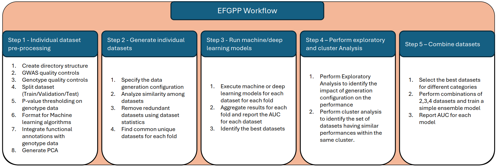
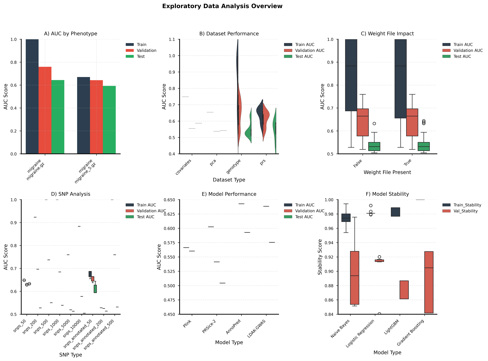
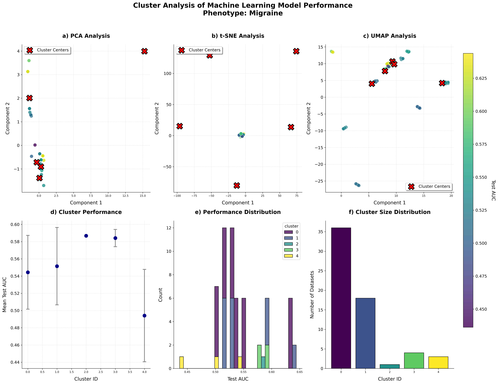
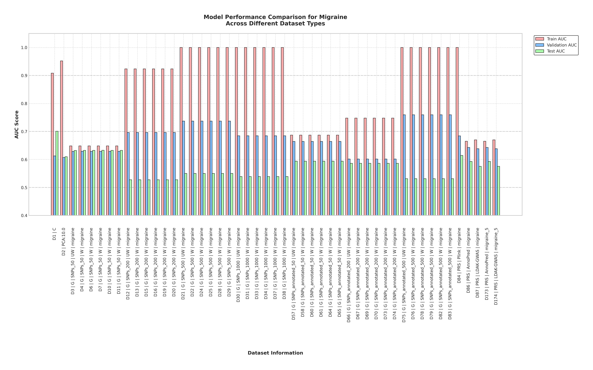

# Exploratory Framework for Genotype-Phenotype Prediction

##Abstract


##Results





## Initial Setup

1. Place your genotype data
2. Put data in the following format for a specific Phenotype
3. Create a directory/Folder

### Directory Structure

```
EFGPP/
```

## Data Requirements

1. Download Annotations.tsv and place it in the working folder from:
   https://drive.google.com/drive/folders/19PMporIqzUj9IY3FNXbnzR_I-aBy8KmT?usp=sharing

Location: `EFGPP/Annotations.tsv`

### Directory Structure for Phenotypes

```
EFGPP/Phenotype
EFGPP/Phenotype/Phenotype_1.gz (GWAS file 1)
EFGPP/Phenotype/Phenotype_2.gz (GWAS file 2)
EFGPP/Phenotype/Phenotype_1 (Directory containing genotype data)
EFGPP/Phenotype/Phenotype_2 (Directory containing genotype data)
```

### Required Files for Each Phenotype

For Phenotype_1:
```
EFGPP/Phenotype/Phenotype_1/Phenotype.gz (Cleaned GWAS file)
EFGPP/Phenotype/Phenotype_1/Phenotype.bed 
EFGPP/Phenotype/Phenotype_1/Phenotype.bim 
EFGPP/Phenotype/Phenotype_1/Phenotype.fam 
EFGPP/Phenotype/Phenotype_1/Phenotype.cov   (FID,IID,COV1,COV2,...)
EFGPP/Phenotype/Phenotype_1/Phenotype.height (FID,IID,Height)
```

For Phenotype_2:
```
EFGPP/Phenotype/Phenotype_2/Phenotype.gz (Cleaned GWAS file)
EFGPP/Phenotype/Phenotype_2/Phenotype.bed 
EFGPP/Phenotype/Phenotype_2/Phenotype.bim 
EFGPP/Phenotype/Phenotype_2/Phenotype.fam 
EFGPP/Phenotype/Phenotype_2/Phenotype.cov   (FID,IID,COV1,COV2,...)
EFGPP/Phenotype/Phenotype_2/Phenotype.height (FID,IID,Height)
```

### Sample File Formats

Sample `EFGPP/Phenotype/Phenotype_2/Phenotype.height`:
```
IID     FID     Height
5777494 5777494 1
3939107 3939107 1
```

Sample `EFGPP/Phenotype/Phenotype_2/Phenotype.gz`:
```
CHR     BP      SNP     A1      A2      N       SE      P       OR      INFO    MAF
8       101592213       rs62513865      T       C       480359  0.0153  0.3438  1.01461 0.957   1
8       106973048       rs79643588      A       G       480359  0.0136  0.1231  1.02122 0.999   1
8       108690829       rs17396518      T       G       480359  0.008   0.6821  1.00331 0.98    1
8       108681675       rs983166        A       C       480359  0.008   0.2784  0.99144 0.991   1
8       103044620       rs28842593      T       C       480359  0.0112  0.3381  0.98926 0.934   1
8       105176418       rs377046245     I       D       480359  0.0196  0.1311  1.03004 0.994   1
8       103128181       chr8_103128181_I        D       I       480359  0.0108  0.968   1.0004  0.995   1
8       100479917       rs3134156       T       C       480359  0.0108  0.6805  0.99561 0.987   1
8       103144592       rs6980591       A       C       480359  0.0095  0.1579  1.01349 0.994    1
```

## Actual Directory Examples

### Migraine Directory Structure
```
EFGPP/migraine/
├── migraine
│   ├── migraine.bed
│   ├── migraine.bim
│   ├── migraine.cov
│   ├── migraine.fam
│   ├── migraine.gz
│   ├── migraine.height
├── migraine_5
│   ├── migraine.bed
│   ├── migraine.bim
│   ├── migraine.cov
│   ├── migraine.fam
│   ├── migraine.gz
│   ├── migraine.height
├── migraine_5.gz (GWAS files)
├── migraine.gz (GWAS files)
```

### Depression Directory Structure
```
EFGPP/depression/
├── depression_11
│   ├── depression.bed
│   ├── depression.bim
│   ├── depression.cov
│   ├── depression.fam
│   ├── depression.gz
├── depression_11.gz
├── depression_17
│   ├── depression.bed
│   ├── depression.bim
│   ├── depression.cov
│   ├── depression.fam
│   ├── depression.gz
├── depression_17.gz
├── depression_4
│   ├── depression.bed
│   ├── depression.bim
│   ├── depression.cov
│   ├── depression.fam
│   ├── depression.gz
├── depression_4.gz
```

## Processing Steps

### Step 2: Quality Controls
Execute this command for quality controls. Specify the Phenotype and GWAS file as arguments:
```bash
python Step2-GWASAndIndividualGenotypeDataQualityControls.py migraine migraine_5.gz
python Step2-GWASAndIndividualGenotypeDataQualityControls.py Phenotype GWASFile
```

### Step 2: Split Data
This step will split the data using stratified fold:
```python
python Step2-SplitData.py 

phenotype_paths = [
    ('migraine', 'migraine/migraine'),
    ('migraine', 'migraine/migraine_5'),
    ('depression', 'depression/depression_11'),
    ('depression', 'depression/depression_17'),
    ('depression', 'depression/depression_4'),
]
```

### Step 3: P-value Threshold
Perform p-value threshold on the genotype data:
```bash
python Step3-PrepareDataForGenotypeMachineDeepLearning-P-valueThreshold.py migraine migraine_5 0
python Step3-PrepareDataForGenotypeMachineDeepLearning-P-valueThreshold.py Phenotype GWASFile Fold
```

### Step 3.1: Functional Annotations
Append functional annotations with the genotype data:
```bash
python Step3.1-UpdateGenotypeWithAnnotationData.py migraine migraine_5 0
python Step3.1-UpdateGenotypeWithAnnotationData.py Phenotype GWASFile Fold
```

### Step 4: Generate PCA
Generate PCA for genotype data:
```bash
python Step4-GeneratePCA.py migraine migraine_5
python Step4-GeneratePCA.py Phenotype GWASFile
```


### Step 5: Generate PRS

Generate PRS scores using various tools:
```bash
# Using Plink
python Step5-Plink.py Phenotype GWASFile 0 
python Step5-Plink.py migraine migraine_5 0

# Using LDAK-GWAS
python Step5-LDAK-GWAS.py migraine migraine_5 0

# Using PRSice-2
python Step5-PRSice-2.py migraine migraine_5 0

# Using AnnoPred
python Step5-AnnoPredCode.py migraine migraine_5 0
```

**Note**: Before running these commands:
- Download and install: Plink, LDAK, LDAK-GWAS, and PRSice-2
- Installation guide: [PRSTools Installation Guide](https://muhammadmuneeb007.github.io/PRSTools/Introduction.html)


### Step 6: Generate Base Datasets

Generate the core base datasets:
```bash
python Step6-CoreBaseDataGenerator.py migraine 0 
python Step6-CoreBaseDataGenerator.py Phenotype Fold
```

This will create datasets in:
```
EFGPP/migraine/Fold_0/Datasets
EFGPP/migraine/Fold_1/Datasets
EFGPP/migraine/Fold_2/Datasets
EFGPP/migraine/Fold_3/Datasets
EFGPP/migraine/Fold_4/Datasets
```

Configuration options in CoreBaseDataGenerator.py:
```python
self.phenotype_gwas_pairs = [
    ("migraine", "migraine.gz"),
    ("migraine", "migraine_5.gz"),
    # ("depression", "depression_11.gz"),
    # ("depression", "depression_4.gz"),
    # ("depression", "depression_17.gz"),
]

self.models = ["Plink", "PRSice-2", "AnnoPred", "LDAK-GWAS"]
self.pca_components = 10
self.scaling_options = [False]  # Can be [True, False]
self.snp_options = [
    "snps_50", "snps_200", "snps_500", "snps_1000",
    "snps_5000", "snps_10000", "snps_annotated_50",
    "snps_annotated_200", "snps_annotated_500"
]
```


### Step 7: Dataset Analysis

Analyze datasets across folds using these commands:

```bash
# Find unique datasets for a specific fold
python Step7-CoreBaseDataSelection-FindSimilarity.py migraine 0
python Step7-CoreBaseDataSelection-FindSimilarity.py Phenotype Fold

# Find common datasets across all folds
python Step7.1-CoreBaseDataSelection-FindCommon.py migraine
python Step7.1-CoreBaseDataSelection-FindCommon.py Phenotype
```

Results will be stored in: `EFGPP/migraine/Results/UniqueDatasets.txt`
### Step 8: ML/DL Algorithm Application

Apply machine learning and deep learning algorithms using:

```bash
python Step8-CoreBasePredictor.py Phenotype Fold NumberofDataset Algorithm
```

Example commands:
- For machine learning:
    ```bash
    python CoreBasePredictor.py migraine 0 1 ML
    ```
- For deep learning:
    ```bash
    python CoreBasePredictor.py migraine 0 1 DL
    ```


### Step 9: Results Aggregation

Aggregate results across folds per dataset:

```bash
# For machine learning results
python Step9-CoreBasePredictorAggregate.py Phenotype Result_Directory  Minimum_Validation_AUC

python Step9-CoreBasePredictorAggregate.py migraine ResultsML 0.5

# For deep learning results
python Step9-CoreBasePredictorAggregate.py migraine ResultsDL 0.5
```

Results are stored in `EFGPP/migraine/Results/ResultsML/Aggregated`

#### Sample Results Format

```csv
Dataset,Model,ML_Parameters,Train AUC,Validation AUC,Test AUC,...
1,Naive Bayes,{'var_smoothing': 1e-07},0.7487,0.5550,0.5867,...
2,Logistic Regression,{'C': 0.1, 'penalty': 'l2'},0.6540,0.5378,0.5419,...
3,Logistic Regression,{'C': 1.0, 'penalty': 'l2'},0.6483,0.6286,0.6321,...
```

### Step 10: Exploratory Data Analysis

Analyze your results with:

```bash
# For basic exploratory data analysis  
python Step10-CoreBaseExploratoryDataAnalysis.py migraine ResultsML 
python Step10-CoreBaseExploratoryDataAnalysis.py Phenotype Result_Directory 
```

This generates comprehensive insights including:
- Top performing models and their frequency
- Best AUC metrics across:
    - Phenotype-GWAS pairs
    - Dataset types
    - Weight file configurations
    - SNP types
    - Model types

Example visualization:


### Step 10.1: Cluster Analysis

Perform cluster analysis with:

```bash
# For detailed cluster analysis
python Step10.1-CoreBaseDataClusterAnalysis.py migraine ResultsML 
python Step10.1-CoreBaseDataClusterAnalysis.py Phenotype Result_Directory  
```

Example cluster visualization:


### Step 11: Find Top Datasets

Get the best datasets based on training/validation stability and AUC:

```bash
# Find top performing datasets
python Step11-CoreBasePredictorFindTop10.py migraine ResultsML 0.6
python Step11-CoreBasePredictorFindTop10.py Phenotype Result_Directory Minimum_Validation_AUC
```

The composite score is calculated as:
```python
valid_models['Composite_Score'] = (
    0.2 * valid_models['Validation AUC_Norm'] +
    0.2 * valid_models['Train_Val_Gap_Norm'] +
    0.2 * valid_models['Train_Stability_Norm'] +
    0.2 * valid_models['Val_Stability_Norm']
)
```

Example visualization:


### Step 12: Make Dataset Combinations

Make categories of the data and try all combinations of the data. There are multiple ways to form the categories.

For genotype data, there are 4 categories: `f"Genotype_{weight_status}_{annotation_status}_{gwas_name}"`. For PRS, there can be PRS tools * GWASFile categories: `f"PRS_{gwas_name}_{model}"` or `f"PRS_{gwas_name}"`.

One can modify the following code to form different categories:

```python
for _, row in results_df.iterrows():
    dataset_id = row['Dataset']
    dataset_type = row['Dataset_Type'].lower()
    annotation_status = get_annotation_status(row.get('snps'))
    
    # Build category key based on dataset type and properties
    if dataset_type == 'genotype':
        weight_status = "W" if row.get('weight_file_present', False) else 'UW'
        gwas_name = get_gwas_name(row.get('gwas_file'))
        category_key = f"Genotype_{weight_status}_{annotation_status}_{gwas_name}"
        
    elif dataset_type == 'prs':
        gwas_name = get_gwas_name(row.get('gwas_file'))
        model = row.get('model', 'NA')
        category_key = f"PRS_{gwas_name}"
        
    elif dataset_type == 'covariates':
        features = row.get('Features', 'NA')
        category_key = f"Covariates"
        
    elif dataset_type == 'pca':
        components = row.get('pca_components', 'NA')
        category_key = f"PCA_{components}"
        
    else:
        category_key = f"Other_{dataset_type}"
    
    categories[category_key].append(dataset_id)
```
The selected datasets for **Configuration 1** and **Configuration 2** are presented in **Table 1** and on GitHub:  
- [Configuration1/best_datasets.csv](Configuration1/best_datasets.csv)  
- [Configuration2/best_datasets.csv](Configuration2/best_datasets.csv)  

Results for each combination are available on GitHub:  
- [Configuration1/ResultsML1.csv](Configuration1/ResultsML1.csv)  
- [Configuration2/ResultsML2.csv](Configuration2/ResultsML2.csv)  


 
```bash
# For detailed cluster analysis
python Step12-Combinations.py --phenotype migraine --results_dir ResultsML
python Step12-Combinations.py --phenotype Phenotype --results_dir Result_Directory  
```

## Step 13: Plot Best Performing Combinations

```bash
python Step13-PlotCombinations.py migraine ResultsML
python Step13-PlotCombinations.py Phenotype Result_Directory
```
 
 

